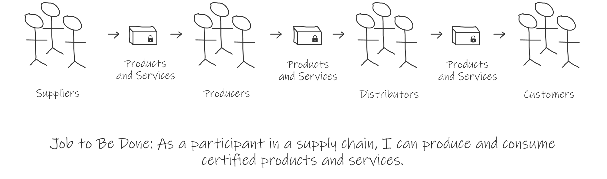
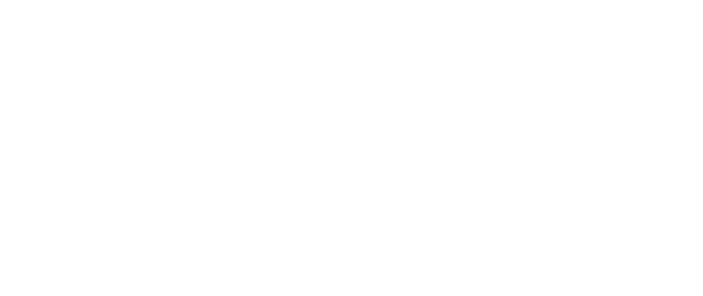

The Supply Chain Project is an open source community that provides standards and tools for producing trustworthy products. The goal is to support the delivery of products that are authentic, reliable, tamper-free, certified and licensed.

_Job to be Done: As a participant in a supply chain, I can produce and consume trustworthy products._

## Supply Chain

A supply chain is a sequence of links in which _producers_ provide items (_artifacts_), and information (_bills of materials_) and _consumers_ use bills of materials to receive and _verify_ artifacts against _policies_.

## Artifacts
Artifacts are items produced and consumed in a supply chain including physical goods, digital goods and certifications:

* Digital goods, e.g. software
* Physical goods, e.g. hardware and devices
* Certifications, e.g. documents that attest to attributes (reliability, integrity, authenticity, security, license, etc.) of other artifacts.

## Bills of Materials
Bills of Materials provide information that allows artifacts to be verified and managed.

* Identity - the name, producer, version, and unique identifier for an item.
* Relationships - relationships and dependencies between an item and other items.
* Creation - information about how an item was created.
* Validation - information about how an item was assessed and validated.
* License - intellectual property requirements governing use of the item.
* Integrity - information that allows verifying that the item has not been tampered with.

Bills of Materials provide information that allows artifacts to be verified and managed.

* Identity - a name, producer, version, and unique identifier for an artifact.
* Materials - a listing of other artifacts used in the creation of an artifact.
* Creation - information about the process followed for creating an artifact.
* License - information that identifies how an artifact can be used.
* Integrity - information that allows verifying that a received artifact is free from tampering during transmission.

Bills of Materials are cryptographically signed for the producer of an artifact.
The Supply Chain Quality project defines a specification for the exchange of artifacts and metadata between producers and consumers.

## Artifact and Metadata Stores

Artifact and metadata stores allow query and distribution of artifacts. Examples of artifact and metadata stores include the following:

*   Source code repositories
*   Application, container, package and artifact stores, registries and repositories
*   Software metadata providers (e.g.[Software Heritage metadata](https://www.softwareheritage.org/2019/05/28/mining-software-metadata-for-80-m-projects-and-even-more/), [Clearly Defined](https://clearlydefined.io/), [Go checksum database](https://go.googlesource.com/proposal/+/master/design/25530-sumdb.md))
*   Installed package databases (e.g. RPMDB)

The Supply Chain Project provides a certification program for artifact and metadata stores implementing the Supply Chain Quality artifact and metadata exchange specifications.

## Policy

Policy describes requirements for artifact consumption, including the following:

*   Allowed producers
*   Allowed licenses
*   Allowed build environments and configurations
*   Required security steps (e.g. scanning)
*   Required certifications (e.g. SDL, industry audits)
*   Expected order of steps in the chain (e.g. to prevent man in the middle attacks)

## Artifact Clients

Artifact clients query metadata stores to receive and process metadata. They may also obtain and inspect artifacts and enforce policy.

Artifact clients query metadata stores to receive information such as the following:

*   Lists of artifacts available
*   Lists of artifacts containing specific metadata values
*   Metadata values across multiple artifacts
*   Metadata values for specific artifacts

 Artifact clients handle policy verification and enforcement including the following:

*   Signature verification
*   Artifact hash verification
*   License verification
*   Build/build environment verification (e.g. reproducible build)
*   Required steps verification
*   Required certification verification
