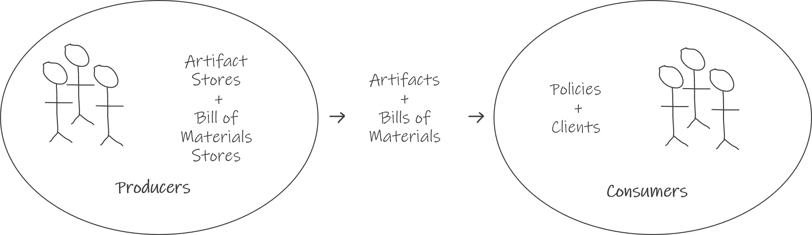

# Supply Chain Project
The Supply Chain Project is an open source community providing tools and standards for managing artifacts across supply chains.

# Supply Chain Concepts

A supply chain is a system of organizations, people, activities, information, and resources involved in managing artifacts across producers and consumers.

## Artifacts and Metadata
Artifacts are materials, products and certifications in a supply chain. Examples of artifacts include the following:

* Digital goods, e.g. software
* Physical goods, e.g. hardware and devices
* Certifications, e.g. documents or data attesting to the attributes of an artifact

Metadata is information that allows artifacts to be verified and managed.

* Identity - a name, producer, version, and unique identifier for an artifact.
* Authenticity - a cryptographic signature for the producer of an artifact.
* Materials - a listing of other artifacts used in the creation of an artifact.
* Creation - information about the process followed for creating an artifact.
* License - information that identifies how an artifact can be used.
* Integrity - information that allows verifying that a received artifact is free from tampering during transmission.

The Supply Chain Project defines a specification for the exchange of artifacts and metadata between producers and consumers.

## Artifact and Metadata Stores

Artifact and metadata stores manage storage, query and distribution of artifacts and metadata. Examples of artifact and metadata stores include the following:

*   Source code repositories
*   Application, container, package and artifact stores, registries and repositories
*   Software metadata providers (e.g.[Software Heritage metadata](https://www.softwareheritage.org/2019/05/28/mining-software-metadata-for-80-m-projects-and-even-more/), [Clearly Defined](https://clearlydefined.io/), [Go checksum database](https://go.googlesource.com/proposal/+/master/design/25530-sumdb.md))
*   Installed package databases (e.g. RPMDB)

The Supply Chain Project provides a certification program for artifact and metadata stores to implement Supply Chain Project artifact and metadata exchange specifications.

## Policy

Policy describes requirements for artifact consumption, including the following:

*   Allowed identities, producers, materials, creation environments and licenses.
*   Required certifications (e.g. quality, security, integrity)
*   Expected order of steps in the chain (e.g. to prevent man in the middle attacks)

Examples of policy specifications today:

*   In-toto sub-layout
*   [Kritis](https://github.com/grafeas/kritis) policy specification for Kubernetes applications

Examples of policy implementations today:

*   [Rego](https://www.openpolicyagent.org/docs/latest/policy-language/) (part of Open Policy Agent - OPA)
*   Kritis [reference implementation](https://github.com/grafeas/kritis/blob/master/docs/install.md) (against Google Cloud Container Analysis API)
*   Linux build system (internal policies)

## Artifact Clients

Artifact clients query metadata stores to receive and process metadata. They may also obtain and inspect artifacts and enforce policy.

Artifact clients query metadata stores to receive information such as the following:

*   Lists of artifacts available
*   Lists of artifacts containing specific metadata values
*   Metadata values across multiple artifacts
*   Metadata values for specific artifacts

 Artifact clients handle policy verification and enforcement including the following:

*   Signature verification
*   Artifact hash verification
*   License verification
*   Build/build environment verification (e.g. reproducible build)
*   Required steps verification
*   Required certification verification

Examples of metadata client implementations today

*   [Open Policy Agent](https://www.openpolicyagent.org/docs/latest/) (OPA)
*   [Grafeas client libraries](https://github.com/grafeas) - including [Kritis](https://www.bing.com/search?q=grafeas+kritis&PC=U531&cvid=e7f41d082a614612b1ffb6c22bf66ae2&FORM=ANNTA9) (admission controller)
*   [In-toto](https://github.com/in-toto/in-toto) verify (admission controller)
*   [The Update Framework](https://github.com/theupdateframework/specification/blob/master/tuf-spec.md) (TUF)-based clients
    *  
